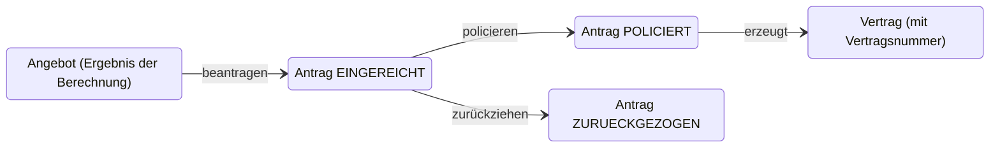

# Coding Dojo: Vom RPC-Endpunkt zur Hypermedia-API

**Richardson Maturity Model am Beispiel einer Hausratversicherung**

In diesem Dojo baut ihr in Pairs eine kleine API für eine Hausratversicherung: Beitrag berechnen, Antrag stellen, Vertrag policieren. Die API wird in vier Iterationen Stufe für Stufe durch das Richardson Maturity Model (Level 0 bis 3) weiterentwickelt. Es geht nicht darum, fertig zu werden, sondern darum zu erleben, was sich mit jeder Stufe am Design ändert.

## Inhalt

- [Ablauf](#ablauf)
- [Richardson Maturity Model](#richardson-maturity-model)
- [Fachlichkeit](#fachlichkeit)
- [Pairing-Regeln](#pairing-regeln)
- [Setup und Rahmenbedingungen](#setup-und-rahmenbedingungen)
- [Iterationen](#iterationen)
- [Stretch Goals](#stretch-goals)
- [Retrospektive](#retrospektive)

## Ablauf

120 Minuten, vier Iterationen, eine Retrospektive.

| Zeit      | Block       | Inhalt                               | Dauer   |
|-----------|-------------|--------------------------------------|---------|
| 0:00      | Intro       | RMM, Fachlichkeit, Pairing-Regeln    | 15 Min. |
| 0:15      | Setup       | Pairs bilden, lauffähiger Server     | 10 Min. |
| 0:25      | Iteration 1 | Level 0                              | 20 Min. |
| 0:45      | Iteration 2 | Level 1                              | 20 Min. |
| 1:05      | Iteration 3 | Level 2                              | 25 Min. |
| 1:30      | Iteration 4 | Level 3                              | 20 Min. |
| 1:50      | Retro       | Austausch im Plenum                  | 10 Min. |

> **Der Vergleich der Stufen zählt.** Der Fachumfang darf schrumpfen, die Stufe selbst wird umgesetzt.

## Richardson Maturity Model

Vier Stufen auf dem Weg zu einer REST-API. Jede Iteration im Dojo entspricht einer Stufe.

| Level | Name             | Kernidee                                    |
|-------|------------------|---------------------------------------------|
| 3     | Hypermedia       | Links nennen die erlaubten Folgeaktionen    |
| 2     | HTTP-Verben      | Verben und Statuscodes tragen die Bedeutung |
| 1     | Ressourcen       | Eigene URLs für fachliche Ressourcen        |
| 0     | The Swamp of POX | Ein Endpunkt, die Aktion steht im Body      |

## Fachlichkeit

Hausrat-Tarif (vereinfacht, fiktiv).

### Eingaben und Validierung

| Eingabe                   | Regel      | Bedeutung                                          |
|---------------------------|------------|----------------------------------------------------|
| Wohnfläche                | 20–500 m²  | Pflichtangabe, der Wert muss in diesem Bereich liegen |
| Postleitzahl              | 5 Ziffern  | Pflichtangabe, die erste Ziffer bestimmt die Tarifzone |
| Selbstbeteiligung         | −10 %      | Nachlass, wenn die Option gewählt wird (ja/nein)   |
| Baustein Fahrraddiebstahl | +15 %      | Zuschlag, wenn der Baustein gewählt wird (ja/nein) |

### Beitragsberechnung

1. **Versicherungssumme:** Wohnfläche × 650 €
2. **Grundbeitrag pro Jahr:** Versicherungssumme × Promillesatz der Tarifzone

   | Erste Ziffer der PLZ | Zone   | Satz  |
   |----------------------|--------|-------|
   | 0–1                  | Zone 3 | 1,9 ‰ |
   | 2–5                  | Zone 2 | 1,4 ‰ |
   | 6–9                  | Zone 1 | 1,0 ‰ |

3. **Zuschlag Fahrrad:** +15 % auf den Beitrag
4. **Nachlass Selbstbeteiligung:** −10 % auf den Beitrag
5. **Mindestbeitrag:** 50 €. Gerundet wird erst am Ende auf 2 Nachkommastellen.

### Referenzfall für Tests

80 m², PLZ 50667, mit Selbstbeteiligung und Fahrrad ergibt **75,35 € pro Jahr**.

| Schritt                     | Wert       |
|-----------------------------|------------|
| Tarifzone (PLZ 50667)       | Zone 2     |
| Versicherungssumme          | 52.000 €   |
| Grundbeitrag (1,4 ‰)        | 72,80 €    |
| Fahrrad +15 %               | 83,72 €    |
| Selbstbeteiligung −10 %     | 75,348 €   |
| **Jahresbeitrag (gerundet)** | **75,35 €** |

### Lebenszyklus

Nur ein eingereichter Antrag kann policiert oder zurückgezogen werden. Policierte oder zurückgezogene Anträge lassen sich nicht mehr ändern.



## Pairing-Regeln

- **Rollen:** Der Driver schreibt den Code. Der Navigator denkt voraus und schreibt keinen Code.
- **Wechsel alle 10 Minuten:** Der Moderator gibt das Signal, Driver und Navigator tauschen.
- **Erfahren mit weniger erfahren:** Erfahrene Entwickler arbeiten möglichst mit weniger erfahrenen zusammen.
- **Ping-Pong-TDD (optional):** Einer schreibt den Test, der andere macht ihn grün.

## Setup und Rahmenbedingungen

*0:15–0:25 · Pairs bilden, leeres Projekt, lauffähiger Server*

- Sprache, Framework und IDE sind frei wählbar.
- Daten liegen nur im Speicher, eine Datenbank ist nicht nötig.
- Getestet wird mit curl, Postman, HTTP-Files oder automatisierten Tests.
- TDD ist ausdrücklich erwünscht.

## Iterationen

### Iteration 1: Level 0 – The Swamp of POX

*0:25–0:45*

- Es gibt einen einzigen Endpunkt, zum Beispiel `POST /api`.
- Die Aktion steht im Body: `berechneBeitrag`, `stelleAntrag`, `policiereAntrag`, `holeVertrag`.
- Fehler kommen mit HTTP 200 und einem Fehlerfeld im Body.

```http
POST /api
Content-Type: application/json

{
  "aktion": "berechneBeitrag",
  "wohnflaeche": 80,
  "plz": "50667",
  "selbstbeteiligung": true,
  "fahrrad": true
}
```

**Fertig, wenn** der Referenzfall berechnet wird und ein Antrag bis zum Vertrag durchläuft.

### Iteration 2: Level 1 – Ressourcen

*0:45–1:05*

Fachliche Ressourcen:

- `/angebote`
- `/angebote/{id}`
- `/antraege/{id}`
- `/vertraege/{id}`

Als Methode darf weiterhin überall `POST` verwendet werden.

**Diskussion im Pair:**

- Ist ein Angebot eine Ressource?
- Ist „policieren“ eine Ressource oder eine Zustandsänderung?

### Iteration 3: Level 2 – HTTP-Verben und Statuscodes

*1:05–1:30*

| Aktion                   | Anfrage                        | Antwort                      |
|--------------------------|--------------------------------|------------------------------|
| Angebot anlegen          | `POST /angebote`               | `201` mit Location-Header    |
| Ressource lesen          | `GET /angebote/{id}` usw.      | `200`, sonst `404`           |
| Eingabe ungültig         | `POST /angebote`               | `400` oder `422` mit Fehlertext |
| Antrag erzeugen          | `POST /antraege` (Angebots-ID) | `201` mit Location-Header    |
| Policieren, Zurückziehen | `PATCH` oder `POST`, eure Wahl | Wahl im Pair begründen       |
| Antrag schon policiert   | Zurückziehen                   | `409 Conflict`               |

### Iteration 4: Level 3 – Hypermedia

*1:30–1:50 · Links nennen die erlaubten Folgeaktionen*

| Ressource             | Enthaltene Links                                   | Fehlende Links                 |
|-----------------------|----------------------------------------------------|--------------------------------|
| Angebot               | `self`, `beantragen`                               |                                |
| Antrag `EINGEREICHT`  | `self`, `policieren`, `zurueckziehen`, `angebot`   |                                |
| Antrag `POLICIERT`    | `self`, `vertrag`                                  | `policieren`, `zurueckziehen`  |
| Vertrag               | `self`, `antrag`                                   |                                |

Das Format ist frei wählbar: HAL, JSON:API oder ein eigenes `_links`-Objekt.

**Fertig, wenn** ein Client den ganzen Ablauf durchläuft, der nur die Einstiegs-URL kennt und sonst nur den Links folgt.

## Stretch Goals

| Thema         | Aufgabe                                                   |
|---------------|-----------------------------------------------------------|
| Einstiegspunkt | `GET /` mit Links auf alle Einstiegsressourcen           |
| Konkurrenz    | `ETag` und `If-Match` für konkurrierende Änderungen am Antrag |
| Fehlerformat  | OpenAPI-Spezifikation oder Problem Details nach RFC 9457  |
| Ratenzahlung  | Monatliche Zahlweise mit 5 % Ratenzuschlag als Parameter  |

## Retrospektive

*1:50–2:00 · Austausch im Plenum*

1. **Größte Veränderung:** Welche Stufe hat das Design am stärksten verändert?
2. **Nutzen im Projekt:** Wo wäre Level 3 in unseren echten Projekten sinnvoll, etwa in Antragsstrecken mit Statusmodell? Wo wäre es Overhead?
3. **Pairing:** Wie hat sich das Pairing angefühlt? Was nehmt ihr mit?
